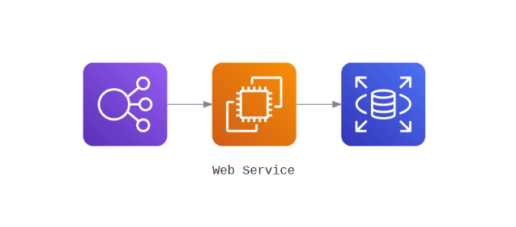

Name: Harpreet Singh
Email : h.singh8149@gmail.com

  

## Assignment 1 :- Explain the below AWS Architecture

* In the first icon, we have an ELB (Elastic load balancer) that automatically distributes incoming traffic across multiple targets, such as EC2 instances, containers, and IP addresses, in one or more Availability Zones.
* In the second icon we have our EC2 instace/instaces that will elaborate our request
* In the third icon we have our RDS (Relational Database Service) distributed maybe in multiple AZ's and making an cluster or sharding architecture.

So to summarize, our load balacer redirects the request to one of the our ec2 instances than our ec2 instance is connected to the RDS or maybe an application is connected to RDS to retrive some data from the database.

## Assignment 2 :- Implement the same in the AWS(only do a proper connection between service)

* Let's create 2 EC2 instaces

* Now let's create a load balancer 

* Now let's RDS multi AZ
* Once we created the RDS multi AZ cluster, let's connect EC2 instance so it can connect to the RDS automatically

* Select EC2 instance

* Now we have correctly connected our ec2 instace

