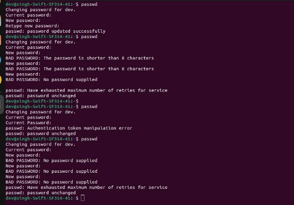
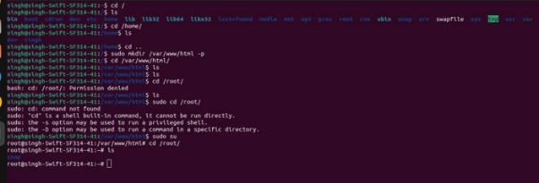
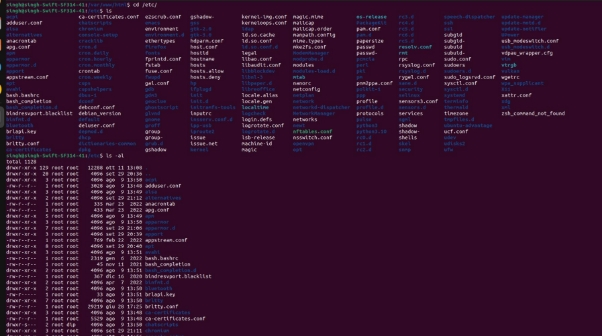
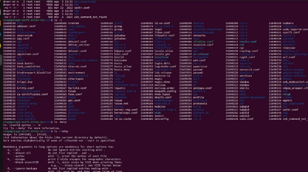
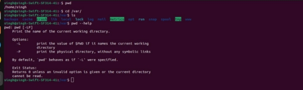

Name: Harpreet Singh

Email : h.singh8149@gmail.com

Assignment 1:

When we try to access a user that doesn’t exist, we are shown with an error which tells us that the user doesn't exist or we are missing some required field.

Assignment 2:

1. When can change the password successfully to IneuR0n#43.
2. When we try to change the password to 1234 or abcd, we are given the error which tells us that  the password is too short.
2. When we try to change the password to an empty password, we are shown with the error that tells us that there is no password supplied.

Assignment 3:

1. With cd / we go to the root folder. Everything starts from this folder: hard drives,usb drivers, all other folders.
1. With cd /home we go to the User’s folder. This folder contains a home folder for each regular user.
1. With /var/www/html from my understanding we are in the apache html folder where we can put our websites.
1. With cd /root we cannot access this folder. The /folder can only be accessed by the root user because it's the root user’s home folder.

Assignment 4:

1. With cd /etc we are in the folder where we can find all the configuration files. Here we can also see some scripts that are executed during the boot.
1. With ls -la we can see list of files inside the folder with permission,file size, user which own the file and other staff. Parameter -a also shows the hidden files: . and .. ->. for current directory, .. for one directory back( from my understanding)
1. With ls -i we can see the the index number (inode) of each file
1. With ls –help we can see what parameter are available for ls command and more about the ls command.



Assignment 5:

