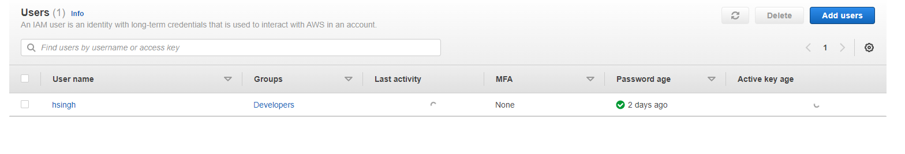
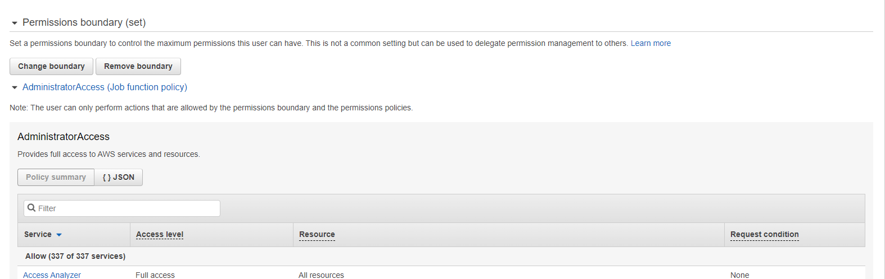
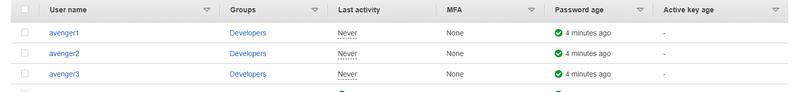
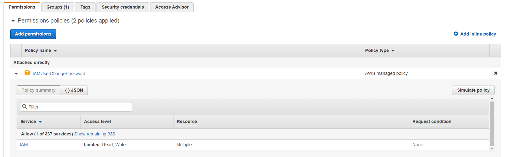
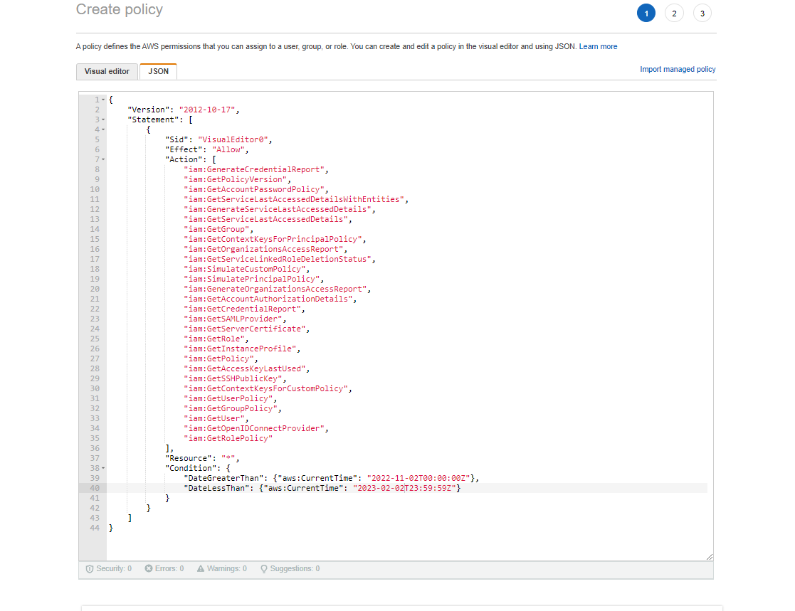
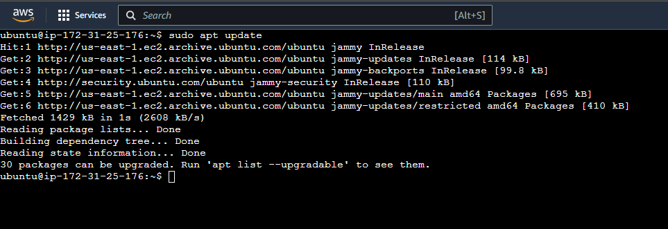

Name: Harpreet Singh

Email : h.singh8149@gmail.com

Assignment 1:

Assignment 2:

All user have IAM policy with modify password and also custom policy with time based access which has all read access properties.

Assignment 3:

1. Created IAM policy with only read access and expire time. This policy is also added to the above assignment.

Assignment 4:

1.By default when you create a new user in the IAM console, the user has no access at all.
A)TRUE Correct
B)FALSE

2.Select the correct statements in regards to IAM:
A) IAM users: Only use EC2 services
B) IAM users: Cannot have ADMIN access
C) IAM users: Individuals who have been granted certain permissions so they can do only specific tasks. Correct

3.By enabling Multi-factor Authentication for all accounts is an additional way to secure IAM for both the root login and new users alike?
A)TRUE Correct
B)FALSE

4.In Identity and Access Management, when you first create a new user, certain security credentials are automatically generated. Which of the below are valid security credentials?
A)Access Key Id and Secret Access Key ,Correct
B) User name and Password
C) None of above

5.Select the correct statements in regards to IAM:
A)The root user does have admin access, correct
B)By default when we create new user in the IAM, it can access all the services

6.A new user has started at your work and it is your job to give them administrator access to the AWS console. What should you do next?
A)Add them to the existing administrator group.correct
B)Manually assign all the admin permission.

7.Which of the following is not the features of IAM?
A)It allows to Instante EC2 Machine 
B)It stands for IAM (for current user dashboard)
C)It allows you to define policies, create new users, group and manage them. CORRECT
D)It allows you to create lamda functions. 

8.Which user has no permission by default
A)EC2 User CORRECT
B)IAM user
C)Root user
D)Service user

9.IAM policy documents are written in which format
A)YAML
B)XML
C)HTML
D)JSON CORRECT

10.One of the elements is an optional element of an IAM policy document, which one is it?
A)Action
B)Version
C)Effect
D)Condition CORRECT

11.What you need to allow a lambda function to do an action on S3 Bucket?
A)IAM Role and IAM Policy CORRECT 
B)IAM User and IAM Policy
C)IAM Role and IAM User
D)STS token and S3 bucket url

11.This IAM resource can be reused across multiple identities, guess who?
A)IAM inline policies
B)IAM Role
C)IAM User
D)IAM Managed Policies CORRECT

12.What is the name of the tool which tells if identities within your account would be able to take actions?
A)The Policy Advisor
B)The Policy Simulator CORRECT
C)The Access Advisor
D)The Access Simulator

13.Which AWS service does not support resource-based policies?
A)EC2 CORRECT
B)KMS
C)S3
D)VPC endpoint

14.Explicit denies have the highest priority in evaluating if an action can be taken
A)TRUE CORRECT
B)FALSE

15.Which of these are features of IAM
A)Password Policy CORRECT
B)Access Advisor CORRECT
C)Billing Report
D)Identity Provider CORRECT

Assignment 5:

