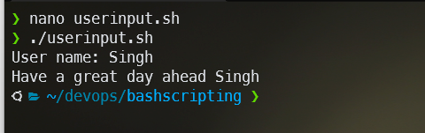
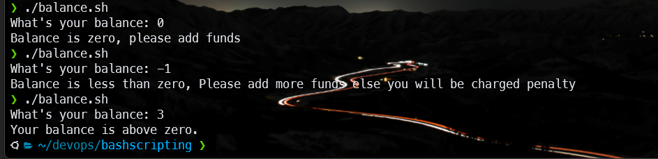

Name: Harpreet Singh

  

Email : h.singh8149@gmail.com

  

## Assignment 1 :- How to upload HTML web pages on Apache2 web server in EC-2 Instance? Please justify with step by step answers.

  ### Install apache

 1. Let’s begin by updating the local package index to reflect the
    latest upstream changes:
	- `sudo apt update`	
 2. Then, install the `apache2` package:
	- `sudo apt install apache2`
 3. Now if we have firewall enabled we can add security policy to incoming and outgoing requests by:
	- `sudo ufw allow 'Apache'`
 4. Now let's check if our Apache instance is running by 
    - `sudo systemctl status apache2`
  ### Host our website 
 1. Create the directory for our domain 
	 - `sudo mkdir /var/www/your_domain`
	 - Example `sudo mkdir /var/www/testsite`
2. In case of wrong permissions and wrong ownership you can change the permissions and owership of the file By:
	- `sudo chown -R user:user /var/www/your_domain` (change of ownership)
	- `sudo chmod -R 755 /var/www/your_domain` (change of permissions)
3. Now let's create our index.html inside our domain folder by
    - `cd /var/www/your_domain`
    - `sudo nano index.html`
    - `hello world!` 
    - `ctrl+s (save the file), ctrl+x (exit)`
 4. Now let's create virtual host file so apache can serve our content 
    - `sudo nano /etc/apache2/sites-available/your_domain.conf`
  Now add
```sh
 <VirtualHost *:80>
     ServerAdmin webmaster@localhost
     ServerName your_domain
     ServerAlias www.your_domain
     DocumentRoot /var/www/your_domain
     ErrorLog ${APACHE_LOG_DIR}/error.log
     CustomLog ${APACHE_LOG_DIR}/access.log combined
 </VirtualHost>
```
Now save by `ctrl+s (save the file), ctrl+x (exit)`

5. Now let's enable the site with 
	- `sudo a2ensite your_domain.conf`
	- Also disable the default site with `sudo a2dissite 000-default.conf`
6. Now let's test if there is any error in our configuration by 
    - `sudo apache2ctl configtest`(if the output is ok proceed otherwise modify the conf file and redo the above steps)
 7. Now restart the apace service by 
    - `sudo systemctl restart apache2`
 
 Now go to you domain and the website should be visable
## Assignment 2 :- Create readfile.sh in which you can read the information of PWD like size,permission, date time etc.


## Assignment 3 :- Take an input of name from user and print Have a great day ahead {name}

## Assignment 4 :
    Let’s take a scenario of fintech app program in which we want to have three separate
    outputs for 3 different situations:
    The balance is less than zero
    The balance is zero
     The balance is above zero
    For instance, in the following program, use the if, elif, else statements to display different outputs in
    different scenarios:
    Use “if” condition to check if the balance is less than zero. If this condition evaluates to true, display
    the message using the echo command: “Balance is less than zero, Please add more funds else you
    will be charged penalty”.
    If the above condition does not match, then use “elif” condition to check if the balance is equal to
    zero. If it evaluates to true, display the message: Balance is zero, please add funds
    If none of the above condition matches, use the “else” condition to display the: Your balance is
    above zero.

